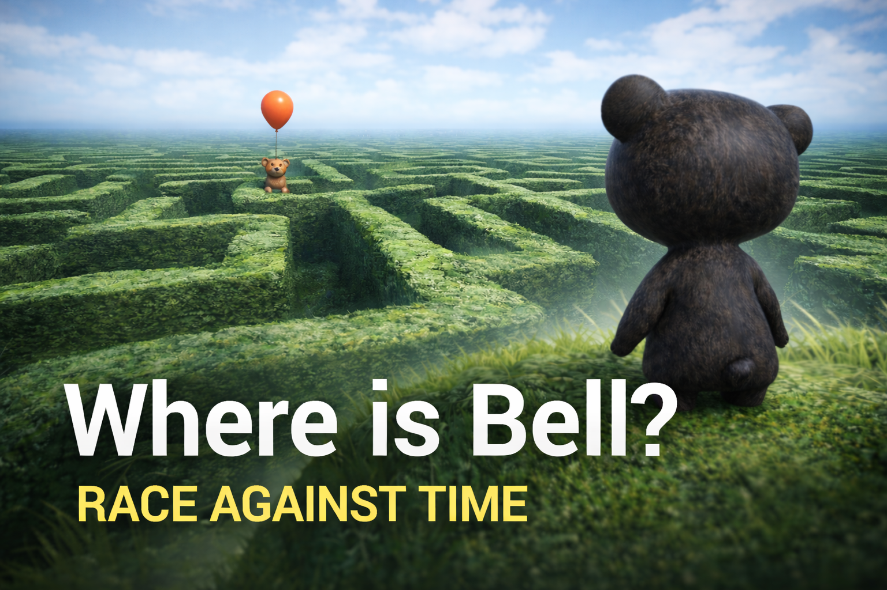
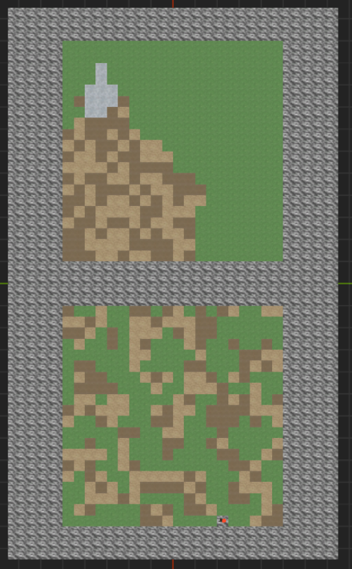
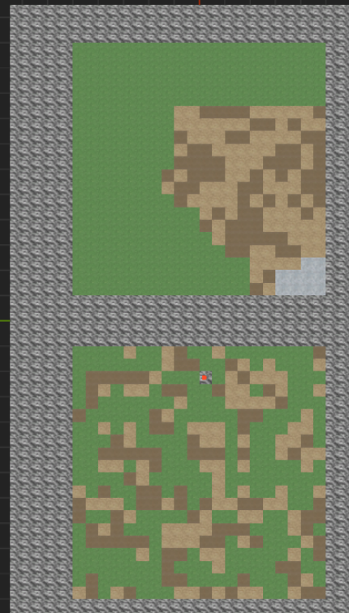
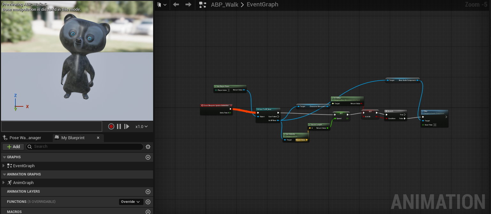
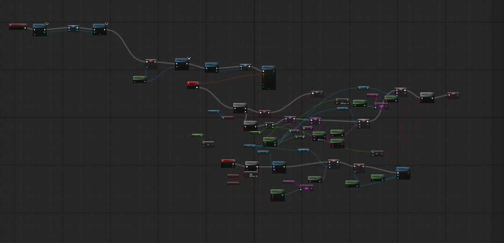
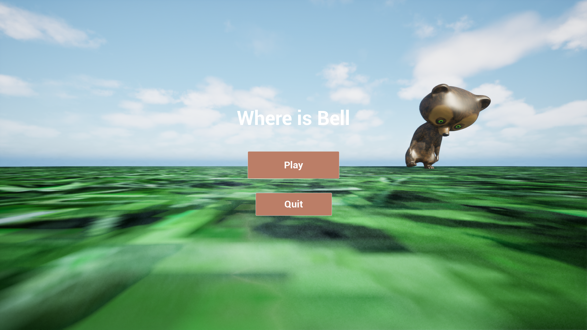
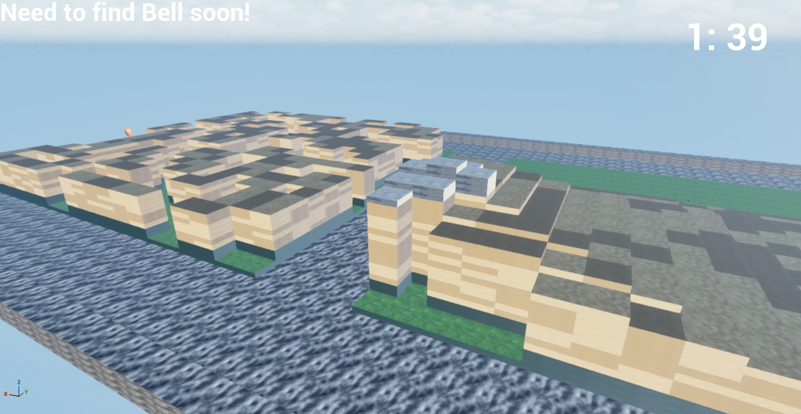

# Where is Bell?



---

A procedural exploration game built in Unreal Engine (C++).

In _Where is Bell?_, you play as a baby bear who must find Bell within
two minutes before panic sets in.\
Each playthrough generates a completely new world composed of two major
areas:

- A procedurally generated Maze
- A procedurally generated Hill

The player must decide: Brute-force the maze... or climb the hill to
spot Bell's orange balloon and plan a smarter route.

---

## Gameplay Overview

### Core Mechanics

- 2-minute countdown timer
- Fully procedural map generation
- Guaranteed maze solvability
- Multiple hill ascent paths
- Visual navigation using balloon visibility

---

# Procedural Systems Breakdown

## 1. Maze Generation (Perlin Noise + Guaranteed Solution)

The maze uses `FMath::PerlinNoise2D` to determine wall placement.

### Noise-Based Grid Construction

```cpp
float NoiseValue = FMath::PerlinNoise2D(FVector2D(X + SeedOffsetX, Y + SeedOffsetY));

if (NoiseValue > Threshold)
{
    Grid[X][Y] = ECellType::Wall;
}
else
{
    Grid[X][Y] = ECellType::Path;
}
```

To prevent unsolvable runs, a guaranteed tunnel is carved between a
random entrance and the goal cell.

```cpp
void CarveGuaranteedPath(FIntPoint Start, FIntPoint Goal)
{
    FIntPoint Current = Start;

    while (Current != Goal)
    {
        if (Current.X != Goal.X)
            Current.X += FMath::Sign(Goal.X - Current.X);
        else if (Current.Y != Goal.Y)
            Current.Y += FMath::Sign(Goal.Y - Current.Y);

        Grid[Current.X][Current.Y] = ECellType::Path;
    }
}
```

This ensures: - Every maze is unique - A valid solution always exists -
Procedural randomness remains intact

---

## 2. Hill Generation (Incremental Height Propagation)

Instead of noise, the hill uses layered expansion logic.

A peak cell is assigned maximum height, then height values propagate
outward:

```cpp
HeightGrid[PeakX][PeakY] = MaxHeight;

for (int Level = MaxHeight - 1; Level >= 0; --Level)
{
    ExpandHeightLayer(Level);
}
```

Each expansion ensures: - Multiple possible ascent paths - No single
forced route - Organic terrain-like structure

---

# Modular World Spawning

The world is built from stacked actor blocks based on matrix values.

```cpp
for (int Z = 0; Z < HeightValue; ++Z)
{
    FVector SpawnLocation = FVector(X * BlockSize, Y * BlockSize, Z * BlockSize);
    GetWorld()->SpawnActor(BlockClass, SpawnLocation, FRotator::ZeroRotator);
}
```

Both hill and maze are offset within the same map, keeping the system
scalable and data-driven.

---






---

# Character Controller

Built using: - Unreal Enhanced Input - Camera-relative movement - Spring
Arm + Follow Camera - Custom tuned movement parameters

---

# Blueprint Systems

## Animation Blueprint

Handles: - Idle animation - Movement blend space - Celebration dance
when Bell is found

---



---

## UI Blueprint

Includes: - Countdown timer display - "Need to find Bell soon!" warning
text - End-state success message

---



---

# Gameplay Screenshots

---






---

# Repository

GitHub:\
https://github.com/MrQuazar/WhereIsBell

Downloadable Build:\
https://drive.google.com/drive/folders/1qCjlzJlgdkxOcee5syWZYiHHrzfHZAV5?usp=sharing

---

# Technical Focus

This project explores:

- Procedural generation with deterministic guarantees
- Balancing randomness and reliability
- Matrix-driven world systems
- Unreal Engine C++ architecture
- Modular scalable environment construction

---

# Future Improvements

- Smarter maze heuristics (A\* validation layer)
- Procedural material variation
- AI emotional state system for Bell
- Expanded level biomes

---

## Author

Developed by Aartem Singh as a procedural systems and Unreal C++ exploration project.
